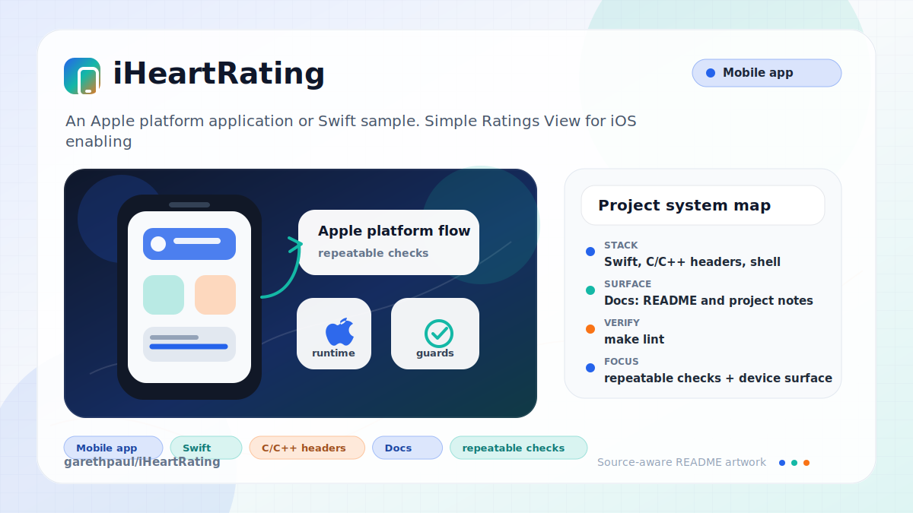

# iHeartRating

<!-- README-OVERVIEW-IMAGE -->


## Overview

`garethpaul/iHeartRating` is an Apple platform application or Swift sample. Simple Ratings View for iOS enabling you to use any image as a rating e.g. hearts, stars, pigeons etc.

This README is based on the checked-in source, manifests, scripts, and repository metadata on the `master` branch. The project language mix found during review was: Swift (6), C/C++ headers (1), shell (1).

## Repository Contents

- `CHANGES.md` - concise history of maintenance changes
- `Makefile` - local verification entry point
- `README.md` - project overview and local usage notes
- `build.sh`
- `example` - source or example code
- `iHeartRating` - source or example code
- `iHeartRating.xcodeproj` - Xcode project file
- `iHeartRating.podspec` - CocoaPods package metadata
- `iHeartRatingTests` - source or example code
- `SECURITY.md` - security reporting and disclosure guidance
- `scripts/check-baseline.py` - static rating-view and package verifier
- `VISION.md` - project direction and maintenance guardrails

Additional scan context:

- Source directories: example, iHeartRating, iHeartRatingTests
- Dependency and build manifests: iHeartRating.podspec
- Entry points or build surfaces: `make check`, build.sh, iHeartRating.xcodeproj
- Test-looking files: example/SampleApp/SampleAppTests/Info.plist, example/SampleApp/SampleAppTests/SampleAppTests.swift, example/SampleApp/SampleAppUITests/Info.plist, example/SampleApp/SampleAppUITests/SampleAppUITests.swift, iHeartRatingTests/Info.plist, iHeartRatingTests/iHeartRatingTests.swift

## Getting Started

### Prerequisites

- Git
- macOS with Xcode for building Apple platform projects
- Python 3 for local static verification on non-macOS hosts

### Setup

```bash
git clone https://github.com/garethpaul/iHeartRating.git
cd iHeartRating
make check
```

The setup commands above validate the static baseline. Full simulator builds still require macOS with Xcode.

## Running or Using the Project

- Open `iHeartRating.xcodeproj` in Xcode, choose the app or sample scheme, and run it on the matching simulator/device.
- Run `./build.sh` when Xcode and the required simulator runtime are installed.
- Use `example/SampleApp` for storyboard/sample-app behavior and `iHeartRating.podspec` for CocoaPods metadata review.

## Testing and Verification

Run the local static baseline:

```bash
make check
```

The baseline parses plist/storyboard/SVG files, validates both podspecs, checks `build.sh` shell syntax, verifies rating-view guards for empty, single-item, zero-size, invalid `maxRating`, rating bounds, non-editable touch endings, empty touch endings, out-of-range bounce configurations, and delegate-independent bounce behavior, and reports when Xcode is unavailable.

For full legacy verification on macOS, use Xcode's test action, `xcodebuild test`, or `./build.sh` with the appropriate scheme and destination.

When the required SDK or runtime is unavailable, use static checks and source review first, then verify on a machine that has the matching platform toolchain.

## Configuration and Secrets

- No required secret or credential file was identified in the repository scan. If you add integrations later, keep secrets out of git.

## Security and Privacy Notes

- Review changes touching network requests, sockets, or service endpoints; examples from the scan include example/SampleApp/SampleApp/Info.plist, example/SampleApp/SampleAppTests/Info.plist, example/SampleApp/SampleAppUITests/Info.plist, iHeartRating/Info.plist, and 1 more.
- Review changes touching mobile permissions or privacy-sensitive device data; examples from the scan include iHeartRating/iHeartRatingView.swift.
- Review changes touching file, media, JSON, XML, CSV, OCR, or data parsing; examples from the scan include example/SampleApp/SampleApp/Info.plist, example/SampleApp/SampleAppTests/Info.plist, example/SampleApp/SampleAppUITests/Info.plist, iHeartRating/Info.plist, and 2 more.
- UI configuration changes should not crash on empty image arrays, single-rating views, zero-sized images, invalid `maxRating`, inconsistent rating bounds, or out-of-range ratings.

## Maintenance Notes

- This looks like an Apple platform project or sample. Xcode, Swift, CocoaPods, and deployment target versions may need to match the original project era.
- See `SECURITY.md` for vulnerability reporting and safe research guidance.
- See `VISION.md` for project direction and contribution guardrails.
- See `docs/plans/2026-06-08-bounce-without-delegate.md` for the bounce-without-delegate guardrail.
- See `docs/plans/2026-06-09-noneditable-touch-end.md` for the non-editable touch-ending guardrail.
- See `docs/plans/2026-06-09-empty-touch-end.md` for the empty touch-ending guardrail.
- Run `make check` before pushing changes to Swift sources, podspecs, plist/storyboard files, or build scripts.

## Contributing

Keep changes small and tied to the project that is already present in this repository. For code changes, document the toolchain used, avoid committing generated dependency directories or local configuration, and update this README when setup or verification steps change.
